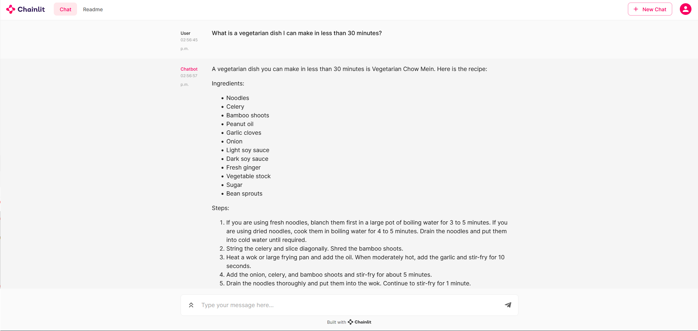

# Hacktoberfest 2023 project: Recipe Suggester Chatbot Using RAG Pipeline

## Description

This chatbot is designed to assist people with choosing a recipe to cook. It is connected to a database of over 200,000 recipes from Food.com. You can ask the chatbot for suggestions of recipes based on criteria like ingredients, meal, cooking time, dietary restrictions, food ethnicity, etc.

## Data sources

Kaggle Dataset: [Recipes from Food.com](https://www.kaggle.com/datasets/shuyangli94/food-com-recipes-and-user-interactions/)

## Methods

We began by loading the data into a Pandas dataframe. The features we decided to use are
* recipe name
* average rating (out of 5)
* cook time (in minutes)
* tags (such as "vegetarian" or "main course")
* description of the dish
* number of ingredients
* list of ingredients
* cooking steps
* nutrition information

We combined these features into a single text string for each recipe, then used a FAISS document store to create vector embeddings for our recipes.

The app is deployed using Chainlit, Docker and Ploomber Cloud.

## Demo

## Team members

Ben Marsh  
Eva Draganova  
Miao Zheng

